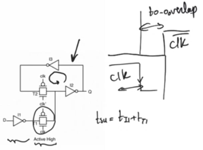
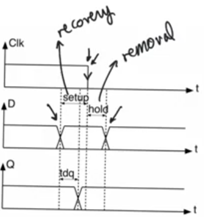
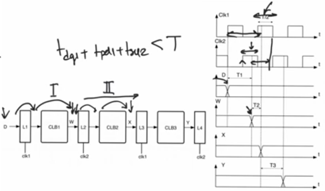
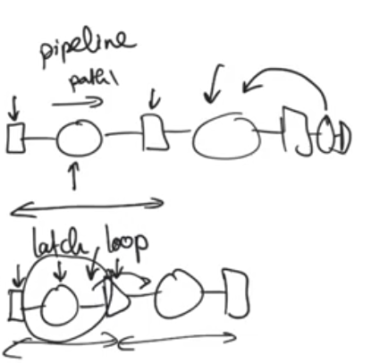
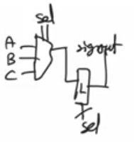
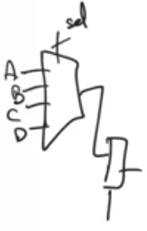

# Latches
source [this](https://www.youtube.com/playlist?list=PLyWAP9QBe16p2HXVcyEgGAFicXJI797jK) playlist on VHDL design.

## Timing in latches
- Latches are transparent at a level of a clock rather than an edge, and opaque at the opposite phase of a clock
- Timing in latches is similar to registers -edge triggered- with some fundamental differences, for an active high latch
- Setup time: time between the falling edge and the input changing before it. 
- also called recovery time, 
- Any change that happens before the setup time, it’ll be transferred to Q, 
- Any change that happens more than Tsetup before the edge of the clock will not be latched properly
- When clock goes from high to low transmission gate T1 will close, so we want give some time before T1 closes for data to be latched properly 
- Setup time should be enough time for data to pass  through inverter i1 and transmission gate T1, same as setup time in a register
- Hold time: time between the falling edge and the input changing after it.
- called removal time because it’s the amount of time after the clock goes inactive that it’s safe after to remove the data from d
- When you lower the clock there will be a 0-0 overlap in the clock, so the Nmos will be working passing the D to Q
- Tdq: time it takes for Q to appear on the output of the latch
- Q will change multiple times within the active phase of the clock, so it’s not a relationship between the clock edge and Q like in register
- It’s the amount of time after D changing till it appears in Q in the active cycle
- D will travel through i1, T1, i2, so Tdq = Ti1+ Tt1+ Ti2
  



# latch pipelines and slack borrowing
- Pipelines that use latches instead of registers have attractive properties and specific dangers
- Example, two mutually exclusive clocks, four latches with combinational logic between them
- Data at w doesn’t need to arrive at the rising edge of clock 2, it needs to arrive within the high phase of clock 2 and L2 will still be able to latch it as long as it arrive tsetup before clock 2 ends
- The amount of time it takes to be available after the first path will eat up from the amount of time available for the second path
- Path i has taken more time than it should, because it has encroached into the active phase of clock 2, this is called the amount of borrow time or the amount of slack that the first path has borrowed from the second path
- Borrowed slack = amount of time the path took - the amount of time it should have taken, this can be negative
- The running total of all paths borrow time cannot exceed T/2-tsetup
- The perks of this is that when we have a fast path and a slow path we allow the slow path to borrow some of the slack that the fast path creates, so this allows us to run this pipeline at a frequency that is close to the average of all the paths 
- Unlike in a register pipeline, operation is at a frequency that the slowest (critical) path allows 




## verdict on latches 
- Latches are dangerous to use if you don’t know what you are doing
- They allow glitches and logical hazards that happen in combinational logic blocks to propagate down the pipeline
- Output of combinational block glitches and doesn’t make a single transition as expected
- When using register pipelines they will not look at the output of combinational blocks until they have finished and all glitches have been resolved
### For FPGA 
- latches don’t have specialized hardware, logic cell in fgpas don’t know how to implement latches they only have register
- They implement latches using lookup tables which leads to very inferior latch and timing properties
- FPGAs have extremely good clock distribution networks, so skew (differential delay in clock ) will be very small in fpgas
- Skew is one of the things latches pipeline use intensively to enhance slack borrowing
- So there is no real benefit of using latches in FPGA
### For ASICs
- Don’t have a low skew specialized clock network like fpga.
- Have specialized standard cells to implement really efficient latches 
- You have to use a very short latch pipeline, and be careful about timing, almost do it manually why?
- In a register pipeline 
- Registers are the beginning and the end of placement and routing
- The PAR tool places two registers and fix the delay between them, then it move to the next path, if there is a problem with a path it changes it only, or maybe goes back to change one of the previous until it resolves it
- The normal flow is that once a path has been placed and routed safely without setup or hold time violations the PAR tool leaves it alone and move to other paths independently
- In a latch loop (latch pipeline)
- When the tool finishes a latch loop (two consecutive latches) and is sure of achieving closure, it goes and place the next one, iPAR tool can’t be sure it have achieved closure for the next path because the closure of a latch loop depends on the running total borrowing
- You cannot place a path and think of it as done, cause they can introduce positive or negative borrowing on the total path
- Solution for this is to Begin a latch loop and end it with registers, within it everything is isolated allowing the placement and routing tool to do placement and routing for this latch loop independently from the rest of the pipeline, and you keep it short
  


# latches and implicit latches in VHDL
- In a process the sensitivity list has to include both D and clk, because if the clock is active and D changes the Q value has to reflect on this change

```
process(clk, D)
begin
    if clk='1' then
        Q <= D;
    end if;
end process;
```

## implicit latching
- Latches get declared by accident, happens when you use conditional statement in a process and forget some of the conditions
- Ifs and cases can be used to do priority encoding (combinational) and can be used to do registering and latching (sequential) 
- You have to do it in either or of these two uses, you shouldn’t mix and match
- In the second case when covering all strong cases for std_logic but not the other cases, an implicit latch is created and it’s dangerous and useless, it’s gonna change the behaviour of the circuit and impede timing analysis

```
process(sel, A, B, C)
begin
    if sel="00" then
        sigout <= A;
    elsif sel="01" then
        sigout <= B;
    elsif sel="10" then
        sigout <= C;
    end if;
end process;
```


```
process(sel, A, B, C, D)
begin
    if sel="00" then
        sigout <= A;
    elsif sel="01" then
        sigout <= B;
    elsif sel="10" then
        sigout <= C;
    elsif sel="11" then
        sigout <= D;
    end if;
end process;
```



### Implicit latches detection in tools
- Implicit latches don’t appear as an error, but they do appear in a list of warnings
- Two types of warnings you should look at
    - Warnings involving implicit latches
    - Warnings involving deficient sensitivity list 
### Implicit latches solution
- Solution whenever using if statement always make the last condition else same with case should be when others
- Implicit latches are sometimes hard to discover 
    - You should always state the values of signals at all cases to make sure the outcome of this process is combinational that you understand
    - Even if stating the values of the signals seems tedious and repetitive you should always do it
  
```
if sel="00" then
    sig1 <= A;sig2 <= B;sig3 <= C;sig4 <= D;
elsif sel="01" then
    sig1 <= B;sig2 <= A;sig4 <= C; // sig3 is not assigned here, an implicit latch might occure
elsif sel="10" then
    sig1 <= D;sig2 <= A;sig3 <= B;sig4 <= D;
else
    sig1 <= B;sig2 <= C;sig3 <= C;sig4 <= C;
end if;
```
