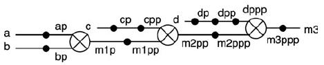

# Pipelining in VHDL
source [this](https://www.youtube.com/playlist?list=PLyWAP9QBe16p2HXVcyEgGAFicXJI797jK) playlist on VHDL design.


## Pipelining
   - Strongly recommend against mixing positive and negative edge triggered registers at least in the same module, 
   - some synthesis tool will refuse to synthesize a design with two clock edge, others will end up reducing frequency of operation by half
   - Separating combinational and sequential logic, separating processing and registering
   - Mixing them would result in an unreadable code, you have to think about which value is being processed

```
process(clk, reset)
begin
    if reset='1' then
        ap <= (others=>'0');
        bp <= (others=>'0');
        cp <= (others=>'0');
        dp <= (others=>'0');
        m1pp <= (others=>'0');
        m2ppp <= (others=>'0');
        m3 <= (others=>'0');
        cpp <= (others=>'0');
        dpp <= (others=>'0');
        dppp <= (others=>'0');
    elsif clk'event and clk = '0' then
        ap <= a; bp <= b;
        cp <= c;
        m1pp <= m1p; cpp <= cp;
        m2ppp <= m2pp;dp <= d;
        dpp <= dp; dppp <= dpp;
        m3 <= m3ppp;
    end if;
end process;

m1p <= ap * bp;
m2pp <= cpp * m1pp;
m3ppp <= dppp * m2ppp;

```


