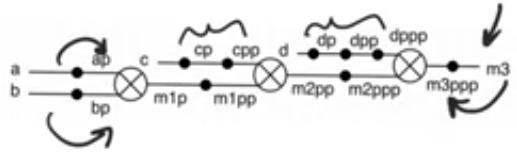
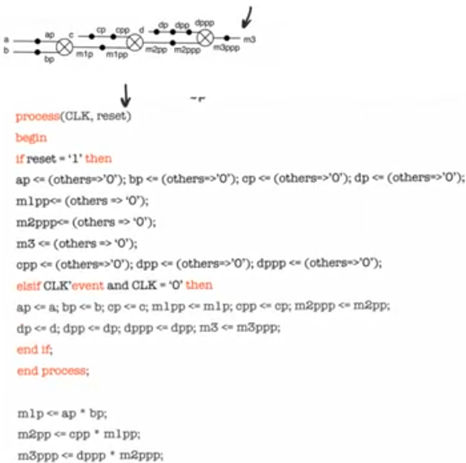

# Pipelining in VHDL
source [this](https://www.youtube.com/playlist?list=PLyWAP9QBe16p2HXVcyEgGAFicXJI797jK) playlist on VHDL design.

## Pipelining
   - Strongly recommend against mixing positive and negative edge triggered registers at least in the same module, 
   - some synthesis tool will refuse to synthesize a design with two clock edge, others will end up reducing frequency of operation by half
   - Separating combinational and sequential logic, separating processing and registering
   - Mixing them would result in an unreadable code, you have to think about which value is being processed

