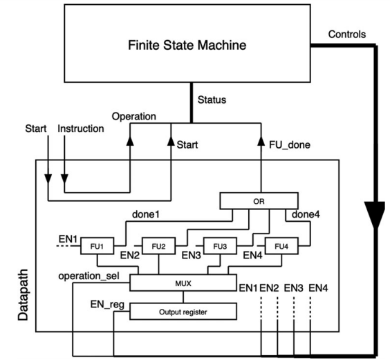
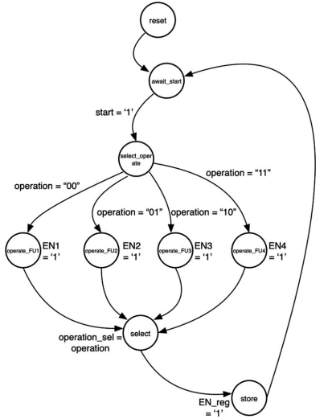

# Finite state machines
source [this](https://www.youtube.com/playlist?list=PLyWAP9QBe16p2HXVcyEgGAFicXJI797jK) playlist on VHDL design.

## Controller and data path architecture
- fsm is a systematic and reliable way to write controllers for data path architectures
- In the datapath and controller architecture we separating processing from control completely 
- processing units are included in the datapath, and they only contain processing units, it doesn't know how or when to operate.
- anything that has to do with intelligence is kept in a controller and the controller contains no processing except the processing necessary to determine how to sequence the events
- the two communicate with each other using control and status signal 
- status signal from the datapath to controller they indicate to the controller the current state of the data path
- the controller then takes the status signal and depending on it, determines what to do next 
- then send the command to the datapath using control signal 
- data inputs and outputs go to the data path and come from it directly
- if some of the inputs are needed to make a decision by the controller, then they'll be rerouted by the datapath through status signal

## Finite state machines
- controllers which look at the datapath and break the state of it down two a finite number of states
- a state is a condition in which the circuit exists which defines a specific outputs and inputs that the datapath has
- we should be able to make a decision about what to do next knowing the current state and the output of the datapath (status signal) only 
- one of the properties of a finite state machine is that at every state all of the control signals going to the datapath are defined 
- a properly designed FSM is a state machine when we are in a certain state we know all of the outputs of the FSM, all of the controls provided to the datapath, we also know the next transition, what is the next state we are going to be, but that can only be deduced if we know the inputs as well as the current state 
- state transition diagram and state transition table

# coding state machines in vhdl
- three process approach, the FSM is coded entirely using three processes 

## Three state processes
- state update process: update the current state to the next state
- next state process: turns in what the next state should be
- output process: turns in the current outputs of the FSM are

## fsm inputs and outputs
- input ports to the FSM should only be the status signals from the datapath, plus the clock and reset
- output ports to the FSM should only be the control signals provided to the datapath

### Next state process
- next state process is a combinational process that determines the next state only, and doesn't update the state of the machine 
- it has a complete sensitivity list, 
- when others helps when the state signal contains unkown state like X,Z value so we go to the reset state because the state machine is in a weird state and doesn't know what to do 
- use elses in conditions to avoid implicit latches 
     
### state update process
- a clocked process, when positive edgo of the clock it updates the current state with the next state value
  

### outputs process 
- outputs process is a combinational process, based on the current state it determines all the outputs of the state machine (all the control signals) even if they are trivial or don't care, we have to define them all, to avoid creating an implicit latch by exhaustivly listing all outputs 
- it should have a when others defined at the end and define what happens to all output signals if an unkown state came, the safest way to do it is to copy everything from the reset state and put it in when others 
     
