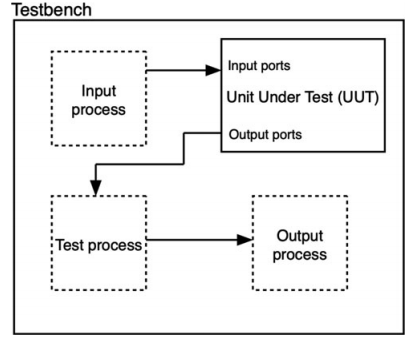

# VHDL software testbenches 
source [this](https://www.youtube.com/playlist?list=PLyWAP9QBe16p2HXVcyEgGAFicXJI797jK) playlist on VHDL design.

## Testbench
- Testing is a whole different science and will be covered in a later module 
- At its core at least functional testing and verification of the design means that you wanna ensure that a design is performing the function you want it to perform
- You apply inputs to the unit under test, observe the outputs and compare them with the outputs you know are true
- It’s a vhdl design but its entity doesn’t have any ports, only an architecture with a single component the unit under test 

## software testbench
- Software testbench means it’ll be used only in software and not gonna pass through synthesis so it doesn’t need to be synthesizable so they allow you programming flexibility to generate inputs and assess the outputs



```
process
begin
    Din <= conv_std_logic_vector(1,4) after 10ns;
            conv_std_logic_vector(2,4) after 100ns;
    Q <= conv_std_logic_vector(3,4) after 100ns;
    wait;
end process;
```
### assert statements
- They look at a condition and if it’s met, they perform a certain assertion
- Can be used concurrently or sequentially 
- Assert condition report “message” severity severityLevel
- Severity levels: note, warning, error, and failure
    - Note, warning, error are quantitative statements about what has happened
    - Failure will cause the simulation to halt 
- Everything is optional the condition, report, severity level if not existent the condition will be assument always true, the default report string is displayed, and default severity of error is assumed by default

```
A <= B+C;
Aout <= A(15 downto 0);
-- B and C are 16 bits each
assert A(16) = '1' report "overflow has occured" severity error; 
```

#### Assert in processes
- assert statement will be implemented sequentially cause it’s in a process 
- The image attribute will return the string equivalent of the integer value within the parenthesis
- At the positive edge of the clock when Dout changes, a transaction happens and the assert will print the previous value, 
- At the negative edge the transaction would have been turned into an event and the current value of Dout will be displyed
```
process(clk)
begin
    if clk'event and clk='1' then
        D1 <= D;
        D2 <= D1;
        D3 <= D2;
        Dout <= D3;
    end if;
    assert report "Value of Dout is" & integer'image(conv_integer(Dout));
end process;
```

### Assert synthesis 
- Synthesis tool will ignore assert statements if used in the design

## hardware testbenches
- Software testbenches are software constructs that only run in simulation to verify the design
- Hardware testbenches are design that contain the unit under test as well as the test circuitry and its supposed to pass through synthesis 
- They are used because of speed, as they run as fast as the underline unit under test, software simulations takes a lot longer than the uut
- Hardware testbenches are usually done are FPGAs not on ASICs
- When used on ASICs this is called design for testability, and that testing hardware is usually expected to be part of  a finished product not a prototype
