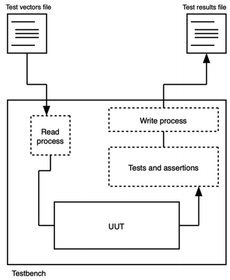
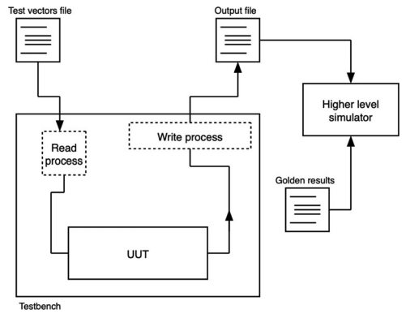
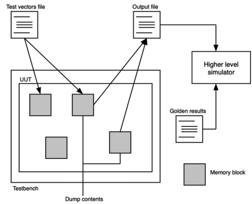

# File I/O in VHDL
source [this](https://www.youtube.com/playlist?list=PLyWAP9QBe16p2HXVcyEgGAFicXJI797jK) playlist on VHDL design.

## File access 
- File access is used to 
- Load test data and dump test results in testbench
- Load large roms 

## File access in vhdl
- To use files you have to declare using two packages 
- std.textio declares two data types file and line types, and four functions read, write, readline, writelines
- Std_logic_textio redefines the functions to accept arguments of std_logic data type instead of bit data type

### writing to a file
- Writing to a file is a two step process
- Write the signal to a line
- Write the line to the file
- Because lines in a file can be of variable length

### Reading from a file  
- Read a line of data
- Access the value from the line you read
```
architecture behavioral of fileio is
    file infile : text open read_mode is "/path/to/infile.txt";
    file outfile : text open write_mode is "/path/to/outfile.txt";
     signal read_word, write_word : std_logic_vector (16-1 downto 0);

begin
    write_word <= conv_std_logic_vector(21,16);

    write_process: process
        variable output_line : line;
    begin
        write(output_line, write_word);
        write_line(outfile, output_line);
        wait;
    end process;

    read_process: process
        variable input_line : line;
    begin
        read_line(infile, input_line);
        read(input_line, read_word);
        wait;
    end process;

end architecture;
```

## approaches in testing
   - Reading the test vector from a file, asserting the results, dumping the results in a file




   - Reading the test vector from a file, dumping the output to a file, analyze the file in a high level simulator 






## Reading and writing to memories
   - Declare a function that reads the memory contents from a file and insert it in a variable
   - It takes zero time to initialize the variables in the ram at the beginning of simulation]
   - To use the function in testbench to initialize the values of the ram we call the function and assign its values to a signals


```
architecture behavioral of ram_block is
    type ram_type is array ((2**address_bits)-1 down to 0) of std_logic_vector(ram_word_width-1 downto 0);
    
    impure function load_memory(load_file_name : in string) return ram_type is 
        file ram_file : text open read_mode is load_file_name;
        variable read_line : line;
        variable ram_contents : ram_type;
    begin
        for i in ram_type'range loop
            readline(ram_file, read_line);
            read(read_line, ram_contents(i));
        end loop;
        return ram_contents;
    end function;

    signal ram_memory : ram_type := load_memory("/path/to/ram_data.dat");

begin
....
end architecture;
```

```
    dump_mem: process(clk)
        variable out_line : line;
    begin
        if clk'event and clk='1' then
            if dump_mem_contents='1' then
                dump_loop for k in 0 to ram_type'range loop
                    write(out_line, conv_integer(ram_memory(k));
                    writeline(output_file, out_line);
                end loop;
            end if;
        end if;
    end process;
```

