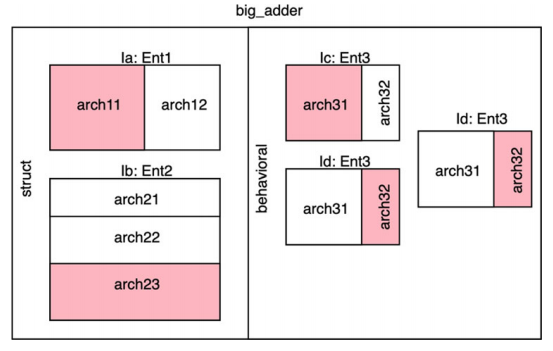
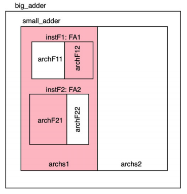
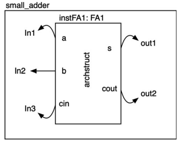

# Configurations in vhdl 
source [this](https://www.youtube.com/playlist?list=PLyWAP9QBe16p2HXVcyEgGAFicXJI797jK) playlist on VHDL design.

## Configuration
- Vhdl elements that can be used in large designs two manage how components are used within the design 
- Used to manage how components are used as an instance within another component 
- Instance architecture binding in a centralized location in a structural way
- Rename the ports of a component before they are used within another design

```
configuration configuration_name of current_level_entity is
    for current_level_architecture
        for instance_label : component_name
            ...
            ...
        end for;

        for instance_label2 : component_name2
            ...
            ...
        end for;
     end for;

    for current_level_architecture2
        for instance_label3 : component_name3
            ...
            ...
        end for;

        for instance_label4 : component_name4
            ...
            ...
        end for;
     end for;

end configuration_name;
```

### Configuration example
- Here we have a big entity called big_adder, and it has two architectures struct and behavioural, each one instantiation other entities
- Architecture struct instantiates arch11 from entity Ent1 and arch23 from Ent2
- Architecture behav instantiates arch31 from Ent3 two times and arch32 from Ent3 one time



```
configuration current_configuration of big_adder is
    for struct
        for insta : ent1
            use entity work.ent1(arch11);
        end for;

        for instb : ent2
            use entity work.ent2(arch23);
        end for;
     end for;

    for behavioral
        for instc : ent3
            use entity work.ent3(arch31);
        end for;

        for instd : ent3
            use entity work.ent3(arch32);
        end for;

        for instd : ent3
            use entity work.ent3(arch32);
        end for;

     end for;

end current_configuration;
```

- Configuration can be used hierarchically to describe instantiations on a hierarchical basis 



```
configuration current_configuration of big_adder is
    for arch1
        for instsa : small_adder
            use entity work.small_adder(archs1);

            for archs1
                for instF1 : FA1
                    use entity work.FA1(archF12);
                end for;
                for instF2 : FA2
                    use entity work.FA2(archF21);
                end for;
            end for;
        end for;
     end for;

end current_configuration;
```

### Port renaming
- Adapt the port name of a component before it’s used in another design
- It doesn’t declare a specific signal connection in the architecture, it’s renaming the ports of the entity 



```
entity FA1 is
    port(a, b, cin : in std_logic;
        s, cout : out std_logic);
end entity;
```
```
architecture arch1 of small_adder is
    component FA1 is
        port (In1, In2, In3 : in std_logic;
            Out1, Out2 : out std_logic);
    end component;
begin
....
end architecture;
```
```
configuration adder_config of small_adder is
    for arch1
        for instaFA1 : FA1
            use entity work.FA1(archstruct);
            port map (a => In1, b => In2, cin => In3, s => Out1, cout=>Out2);
    end for;
end adder_config; 
```

### Verdict
- Configuration in small designs are generally not that good, they do help in very large designs which is managed by many different people, or when you use other code that doesn’t follow some convention you are using and need to rename port names
