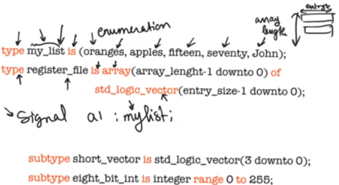

# User defined types
source [this](https://www.youtube.com/playlist?list=PLyWAP9QBe16p2HXVcyEgGAFicXJI797jK) playlist on VHDL design.

## Types and subtypes
- User defined types and subtypes are good practice that improve code readability without impacting synthesizability in any way
- A port is declared in the entity and it describes input/output signals
- A signal is a node, or wire, internal connection, not a register, declared in the arch
- Enumeration when translated to hardware they will be translated into registers carrying bits, useful in a state machines
- Array are important, used extensively when describing memories
- Subtypes, subsets of the types
- Types and subtypes only materialize +when used to declare a signal, declaring a type doesn’t indicate a signal declaration

