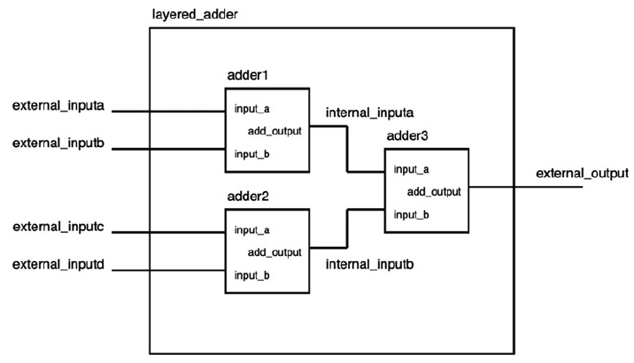

# Hierarchical design 
source [this](https://www.youtube.com/playlist?list=PLyWAP9QBe16p2HXVcyEgGAFicXJI797jK) playlist on VHDL design.

## Components
- A component is a design that exists in the work library, declared somewhere else as an entity with its architecture so its a complete design available for use in the current desgin because it belongs to the work library
   - Component entityName is ... port declaration of entity ... end component
   - It does not indicate how many instantiations of the entity gonna be used in the architecture or how they’ll be connected, it just indicates our intention to use this entity in our architecture, so far we haven’t actually used it and it would not be added to our hardware cost. 

## Components in hardware
- Hardware cost, critical path, everything is dependant upon the part after begin keyword of the architecture

## Component instantiation
- Instantiating a component after begin 
   - Optional_label_name(recommended) : component_name/entity’s_name
   - Port map(Listing of input and output ports of the instance);
   - Each port of any instance has to be connected to either an internal signal or one of the input output ports of the layered design

## Example

- Declaring a component

```
architecture hierarchical of layered_adder is

component sixteen_bit_adder is
port(
input_a: in std_logic_vector (16-1 downto 0);
input_b: in std_logic_vector (16-1 downto 0);
add_output: out std_logic_vector (17-1 downto 0)
);
end component;

component seventeen_bit_adder is
port(
input_a: in std_logic_vector (17-1 downto 0);
input_b: in std_logic_vector (17-1 downto 0);
add_output: out std_logic_vector (18-1 downto 0)
);
end component;

signal internal_inputa: std_logic_vector(17-1 downto 0);
signal internal_inputb: std_logic_vector(17-1 downto 0);
```

- Using a component/instantiating an entity

```
    beign

    adder1: sixteen_bit_adder
    port(
    input_a => external_inputa,
    input_b => external_inputb,
    add_output => internal_inputa);
    
    adder2: sixteen_bit_adder
    port(
    input_a => external_inputc,
    input_b => external_inputd,
    add_output => internal_inputb);
    
    adder3: seventeen_bit_adder
    port(
    input_a => internal_inputa,
    input_b => internal_inputb,
    add_output => external_output);
```

